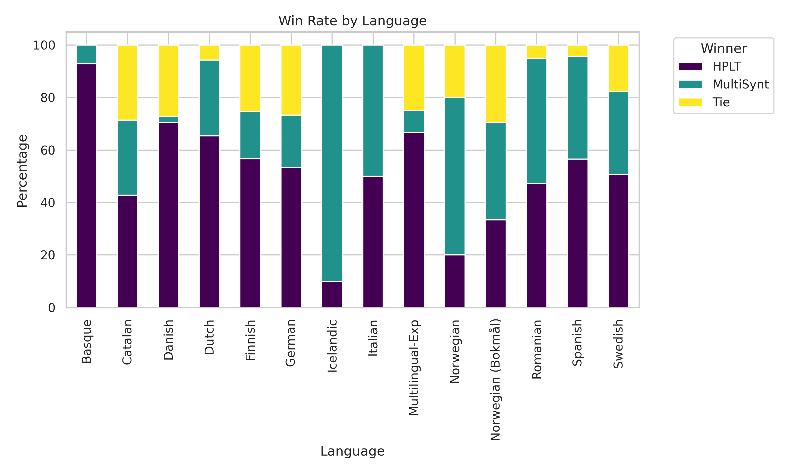
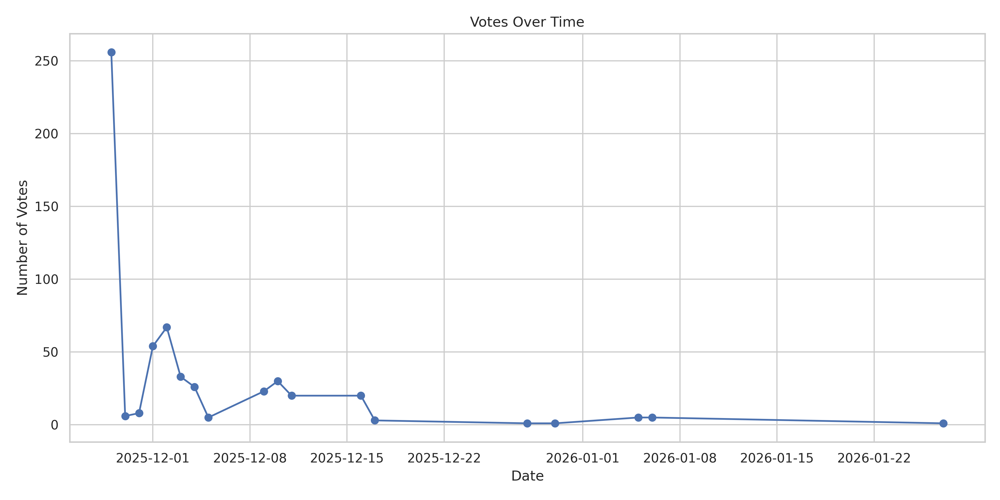

# **⚔️ OELLM Arena**

**OELLM Arena** (Open European LLM Arena) is a specialized "Chatbot Arena" for evaluating open-source Large Language Models (LLMs) across a wide spectrum of European languages.  
It facilitates **blind A/B testing** between two distinct families of monolingual models:

* **Model A (MultiSynt):** Instruction-tuned models (Tower, Opus) based on Nemotron architecture.  
* **Model B (HPLT):** Monolingual reference models (Base models) from the High Performance Language Technologies project.

The application is designed for GPU-accelerated servers (Dual L4 GPUs recommended) and orchestrates inference to allow parallel loading of competing models.

## **✨ Key Features**

* **Language-First Workflow:** Users select a target language (e.g., Basque, Swedish, Italian) rather than specific models, ensuring unbiased evaluation.  
* **Blind Evaluation:** Model identities are strictly hidden until the vote is cast.  
* **Dynamic Matchups:** The system randomly selects specific architectures (e.g., MultiSynt Tower9b vs MultiSynt Opus) to compete against the HPLT reference model.  
* **Dual-GPU Orchestration:** Efficiently maps Model A to GPU 0 and Model B to GPU 1\.  
* **Live Analytics:** Visualizes win rates by language and by model architecture (e.g., Opus vs Tower).  
* **Persistent Logging:** All prompts, generated responses, and user votes are saved to arena\_results.csv for linguistic analysis.

## **📊 Arena Statistics**

Here are the current standings and activity in the OELLM Arena:

### **Win Rate by Language**


### **Votes Over Time**


## **🌍 Supported Languages**

The arena supports 13+ languages across multiple families:

* **Nordic:** Icelandic, Swedish, Danish, Norwegian (Bokmål), Finnish.  
* **Germanic:** German, Dutch.  
* **Romance:** Spanish, Italian, Portuguese, Romanian, Catalan.  
* **Other:** Basque.

## **🛠️ Installation**

### **Prerequisites**

* **Hardware:** Linux server with NVIDIA GPUs (min. 2x L4 or A100 recommended for 24GB+ VRAM).  
* **Software:** Python 3.10+, CUDA drivers.

### **Setup**

1. **Clone the repository:**  
   git clone \[https://github.com/your-username/oellm-arena.git\](https://github.com/your-username/oellm-arena.git)  
   cd oellm-arena

3. **Install dependencies with uv:**
   ```bash
   # Install uv if not already installed
   pip install uv

   # Initialize and sync dependencies
   uv sync
   source .venv/bin/activate
   ```

   *Alternatively, using standard pip:*
   ```bash
   pip install -r requirements.txt
   ```

## **🚀 Usage**

### **Local Development**

To run the app on your local machine for testing:  
streamlit run app.py

### **Automated Backend Benchmark**

To run the automated model comparison script which generates responses for all languages (or a limit):

```bash
# Run for all languages
uv run python benchmark_backend.py

# Run for a specific number of languages (e.g., test 1)
uv run python benchmark_backend.py --limit 1
```

Results are saved to `backend_benchmark_results.csv`.

### **Server Production (with Sub-path)**

To run the app persistently on a server under a specific URL path (e.g., domain.com/oellmarena), use tmux:

1. **Start a persistent session:**  
   tmux new \-s arena

2. **Run the app with the Base URL flag:**  
   streamlit run app.py \--server.port 8501 \--server.baseUrlPath=oellmarena

3. **Detach:** Press Ctrl+B, then D.

## **🌐 Nginx Deployment & SSL**

This application is designed to sit behind an Nginx reverse proxy. Below is the configuration for serving the app securely under /oellmarena.

### **Nginx Configuration**

File: /etc/nginx/sites-available/your-domain.com  
server {  
    listen 80;  
    server\_name your-domain.com;  
      
    \# Allow Certbot challenges  
    location ^\~ /.well-known/acme-challenge/ {  
        default\_type "text/plain";  
        root /var/www/certbot;  
    }

    \# Redirect HTTP to HTTPS  
    location / {  
        return 301 https://$host$request\_uri;  
    }  
}

server {  
    listen 443 ssl;  
    server\_name your-domain.com;

    \# SSL Certificates (Managed by Certbot)  
    ssl\_certificate /etc/letsencrypt/live/\[your-domain.com/fullchain.pem\](https://your-domain.com/fullchain.pem);  
    ssl\_certificate\_key /etc/letsencrypt/live/\[your-domain.com/privkey.pem\](https://your-domain.com/privkey.pem);

    \# Security Protocols  
    ssl\_protocols TLSv1.2 TLSv1.3;  
    ssl\_ciphers HIGH:\!aNULL:\!MD5;

    \# 1\. Trailing Slash Redirect (Vital for Streamlit)  
    location \= /oellmarena {  
        return 301 /oellmarena/;  
    }

    \# 2\. Proxy to Streamlit App  
    location /oellmarena/ {  
        proxy\_pass \[http://127.0.0.1:8501/oellmarena/\](http://127.0.0.1:8501/oellmarena/);  
        proxy\_http\_version 1.1;  
        proxy\_set\_header X-Forwarded-For $proxy\_add\_x\_forwarded\_for;  
        proxy\_set\_header Host $host;  
        proxy\_set\_header Upgrade $http\_upgrade;  
        proxy\_set\_header Connection "upgrade";  
        proxy\_read\_timeout 86400;  
    }  
}

## **🤖 Models & Attribution**

This arena compares models from two primary collections:

1. **MultiSynt Models:** [Hugging Face Collection](https://huggingface.co/MultiSynt/models) \- Instruction-tuned models optimized for specific languages.  
2. **HPLT Models:** [Hugging Face Collection](https://huggingface.co/collections/HPLT/hplt-20-monolingual-reference-models) \- Monolingual base models from the High Performance Language Technologies project.

## **📄 License**

MIT License